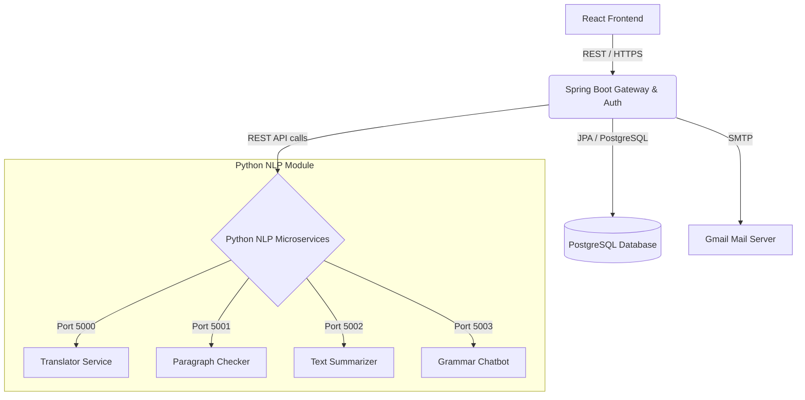

# 🎙️ Convomate Backend (Spring Boot REST API)

[](https://spring.io/projects/spring-boot)
[](https://www.oracle.com/java/technologies/)
[](https://maven.apache.org/)
[](https://www.postgresql.org/)
[](https://hub.docker.com/r/suyash30/convomate-spring-app)

Welcome to the backend core of **Convomate**, a decoupled full-stack platform featuring custom NLP modules (translation, grammar checking, summarization, and chatbot). The backend serves as the orchestration layer—handling authentication, routing NLP requests to dedicated Python Flask microservices, processing feedback reviews, and managing user data.

---

## 🏗️ Architecture & Flow



---

## ⚡ Features

- **Decoupled Gateway Routing:** Translates and forwards client requests to specific NLP services running inside the Python container.
- **Secure Authentication:** Implements JWT (JSON Web Token) role-based security & dynamic OTP generation for secure registrations and logins.
- **OTP Verification & Emails:** Integrates Spring Boot Starter Mail with customized HTML template rendering (using Thymeleaf) for user welcome and registration confirmation.
- **Auto Containerization:** Utilizes the Google Jib plugin to package the Spring Boot app into minimal container images without needing a local Docker daemon.
- **Interactive Swagger UI:** Auto-generates complete OpenAPI documentation for testing all API endpoints interactively.

---

## 🛠️ Tech Stack & Dependencies

- **Java Version:** JDK 21
- **Framework:** Spring Boot 3.4.1 (Web, Security, Data JPA, Validation, Mail, Thymeleaf)
- **Database:** PostgreSQL (Driver `42.7.5`)
- **Authentication:** `io.jsonwebtoken:jjwt` (JWT utilities)
- **API Docs:** `springdoc-openapi-starter-webmvc-ui` (Swagger UI v2.8.3)
- **Utilities:** Lombok (reducing boilerplate), Log4j (logging)

---

## 📂 Codebase Structure

```bash
CONVOMATE-BACKEND/
├── src/main/java/com/net/backend/
│   ├── BackendApplication.java       # Main Spring Boot Entry Point
│   ├── config/                       # CORS, Swagger & Template Configuration
│   ├── controller/                   # REST API Entrypoints (User, Model forwarding)
│   ├── entity/                       # JPA Database Models (User, Review)
│   ├── model/                        # DTO Requests & Responses
│   ├── repository/                   # JPA Repositories (PostgreSQL mappings)
│   ├── security/                     # Spring Security Configurations, JWT Filters
│   └── service/                      # Core Logic (UserService, OtpService, EmailService, ModelService)
├── src/main/resources/
│   ├── application-public.yml        # Main Configuration File
│   └── templates/                    # Thymeleaf Mail Templates (HTML / CSS)
└── pom.xml                           # Project Dependency & Plugin Configuration
```

---

## 🚀 Quick Start & Setup

### Prerequisites
- **Java 21** or higher
- **Maven 3.8+**
- **PostgreSQL 15+** (running with a database named `convomant`)
- A Python environment running the NLP services (or via Docker Compose)

### 1. Database Setup
Ensure PostgreSQL is running, then create the database:
```sql
CREATE DATABASE convomant;
```

### 2. Configurations
Open [`application-public.yml`](file:///c:/Users/sheva/antigravity/Spreezy/CONVOMATE-BACKEND/src/main/resources/application-public.yml) and configure your datasource, mail properties, and target Python Flask ports:
```yaml
spring:
  datasource:
    url: jdbc:postgresql://localhost:5432/convomant
    username: <your-db-username>
    password: <your-db-password>
  mail:
    host: smtp.gmail.com
    port: 587
    username: convomate.contact@gmail.com
    password: <your-gmail-app-password>
```

### 3. Run Locally
Navigate to the root directory and run the Spring Boot app:
```bash
mvn spring-boot:run
```
The server will start on port `8080` by default.

---

## 🐳 Containerization & Deployment

This project uses **Google Jib** to build and push Docker images easily. 

### Build Local Image
```bash
mvn compile jib:dockerBuild
```

### Push to Docker Registry (DockerHub)
```bash
mvn compile jib:build
```
*Note: Make sure target registry configurations in `pom.xml` reflect your credentials and tags.*

---

## 📖 API Documentation & Endpoints

Once the backend is running, access the interactive Swagger documentation at:
🔗 **[http://localhost:8080/swagger-ui.html](http://localhost:8080/swagger-ui.html)**

### Key Endpoint Subsystems:
- **User Authentication (`/user/*`):**
  - `POST /user/register` - Create user profile and generate validation email.
  - `POST /user/generateOtp` - Send OTP for passwordless login.
  - `POST /user/login` - Validate OTP and return a JWT access token.
  - `GET /user/profile` - Secure user dashboard statistics.
- **User Reviews (`/user/review/*`):**
  - `POST /user/review/submit` - Save user testimonials/feedback.
  - `GET /user/review/all` - List reviews dynamically.
- **NLP Router `/model/*` (Forwards to Python microservices):**
  - `POST /model/translate` - Forwards translation instructions.
  - `POST /model/correct_text` - Grammar checker interface.
  - `POST /model/summarize` - Summarizes long texts.
  - `POST /model/chat` - Submits chatbot query.
  - `GET /model/start` - Initializes a new chatbot session.

---

## 👥 Related Repositories

- 🎨 **[CONVOMATE-FRONTEND](https://github.com/Shevadesuyash/CONVOMATE-FRONTEND)** - The React-based user interface.
- 🐍 **[Convomate-Python-module](https://github.com/Shevadesuyash/Convomate-Python-module)** - Core Python-based ML and NLP engines.